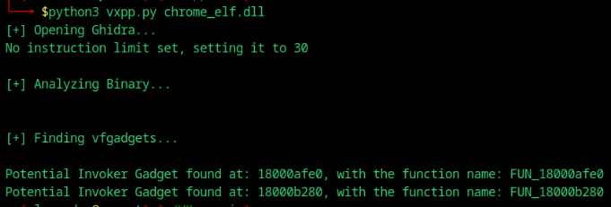

# VX++

\\
This is a simple script that looks for usable vfgadgets in a Counterfeit-Object Oriented Programming (COOP) or a Loop Oriented Programming (LOP) attack. COOP is an exploitation technique that bypasses advanced security mitigations like Intel CET. COOP involves injecting counterfeit objects into a program with different vtables with pointers to legitimate functions that can be chained to execute arbitrary code. LOP involves overwriting a dispatch table with pointers to LOP gadgets. A looper loops through the overwritten table to execute gadgets. This script is also a free alternative to Uf0's idapython script so you don't have to buy IDA Pro to use Idapython.

# Features

Here is a list of VFGadgets that are supported:

| VFGadget | Support |  Description |
| --- | --- | --- |
| ML-G and Variants | Supported | Loops through an object's encapsulatd classes and calls a virtual method of the subclass | 
| ARITH-G | Supported | Does a simple mathematical operation to a field |
| LOAD-R64-G | Supported | Loads an argument into a register (meant for x64) |
| Invoker | Supported | Invokes an API function |
| W-G and variants | Planned | Writes to memory |

These VFGadgets work for both COOP and LOP.

# Effectiveness Against Exploit Protections

| Protection | Support |  Description |
| --- | --- | --- |
| Intel CET | Bypassed | This feature uses shadow stacks to detect IP overwrites and checks branches to validate a call target. |
| Windows CFG | Bypassed | This feature validates the destination of a call target. |
| VTGuard | Bypassed | To bypass, simply use LOP. |
| Windows XFG | Partial | This Feature validates the parameters and return type destination of a call target via hashes. This script marks hashes of hashed functions. |

# How to run:
- Install ghidra
- Install requirements: ```pip install -r requirements.txt```
- Set your GHIDRA_INSTALL_DIR environment variable to your Ghidra installation location
- Run the script
  
This script is designed for Python 3.10 or later

Syntax:
```python3 vxpp.py your_bin_name_here.exe max_vfgadget_length```

# Examples:
Microsoft Photos (PhotoViewer.dll): 9 potential MainLoop-Gadgets found


Google Chrome (chrome_elf.dll): 2 Invoker Gadgets found

