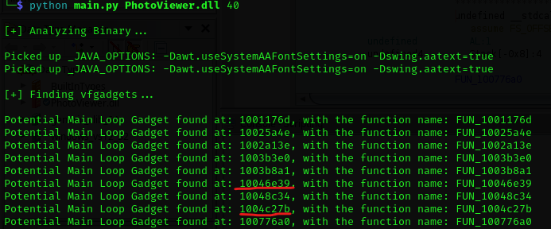

# VX++

This is a simple script that looks for usable vfgadgets in a Counterfeit-Object Oriented Programming (COOP) attack. COOP is an exploitation technique that bypasses advanced security mitigations like Intel CET. COOP involves injecting counterfeit objects into a program with different vtables with pointers to legitimate functions that can be chained to execute arbitrary code. This script is also a free alternative to Uf0's idapython script so you don't have to buy IDA Pro to use Idapython.

Due to the limitaions of the required software, I will be switching the main script to something easier to work with.

How to run:
- Install ghidra
- Install requirements: ```pip install pyhidra```
- Set your GHIDRA_INSTALL_DIR environment variable to your Ghidra installation location
- Run the script

Syntax:
```python main.py your_bin_name_here.exe max_vfgadget_length```

# Test Cases:
Microsoft Photos (PhotoViewer.dll), 9 potential ML-Gadgets found, 2 of which are usable

